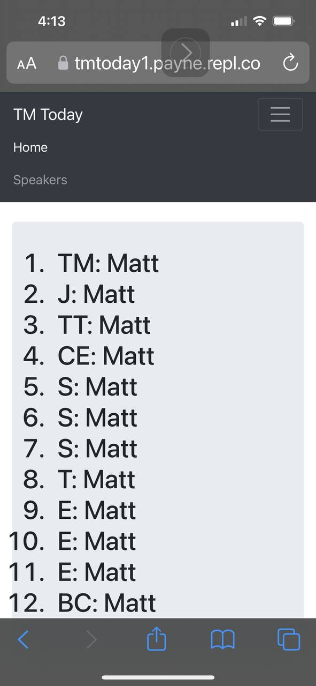

Playing with a utility for who's doing what at a toastmasters meeting.  

### live URL: https://payne.github.io/TMtoday1/index.html

## Ideas:
1. menu item to show everyone who has a duty
1. menu item showing just speakers
1. menu item showing just evaluators
1. Drop down list for choosing the day (defaults to today or next upcoming meeting)

Here's a screen grab of the first baby step:

This project uses [my favorite chunk of bootstrap boilerplate](https://raw.githubusercontent.com/fontenele/bootstrap-navbar-dropdowns/master/example-bs4.html).
Many thanks [Guilherme Fontenele](https://github.com/fontenele/bootstrap-navbar-dropdowns)!!

